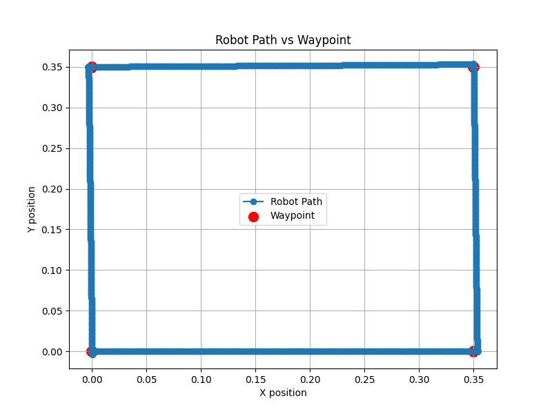
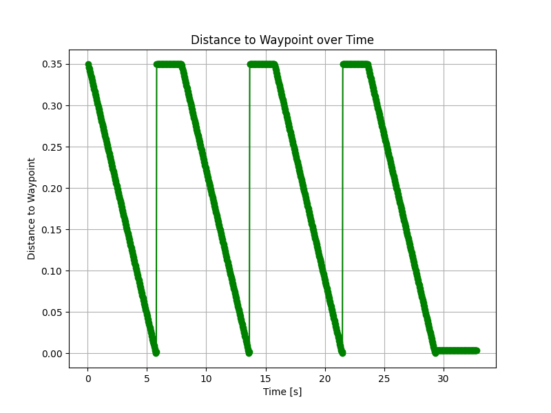
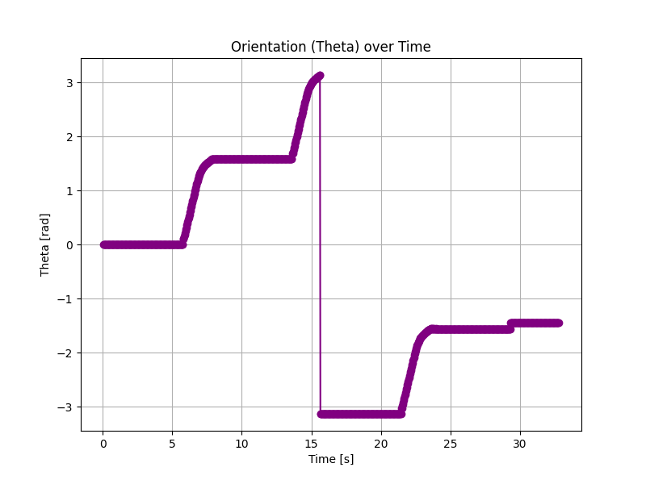

# Odometry-Based Waypoint Navigation with FSM Control

## 1. Overview

This project implements *odometry-based waypoint navigation* for a differential-drive mobile robot (e-puck) using a *finite-state machine (FSM)* and *geometric control. The robot navigates through a predefined sequence of waypoints while estimating its pose ((x, y, \theta)) exclusively from **wheel encoder feedback*.

The primary objective of this work is to *evaluate the effectiveness and limitations of odometry-only navigation* for structured waypoint tracking in a controlled environment. This project serves as a foundational step toward more advanced topics such as *localization, mapping (SLAM), and autonomous navigation*.

---

## 2. Robot & Simulation Setup

* *Simulator:* Webots
* *Robot:* e-puck (differential drive)
* *Wheel Radius:* 0.0205 m
* *Axle Length:* 0.0565 m
* *Control Frequency:* 32 ms
* *Programming Language:* C
* *Actuation:* Velocity-controlled wheel motors
* *Sensing:* Incremental wheel encoders (odometry)
* *Ground Truth:* Webots Supervisor (for validation only)

---

## 3. Navigation Strategy

Waypoint navigation is implemented using a *finite-state machine (FSM)* that explicitly decouples *orientation alignment* from *forward motion*. This structure improves predictability, reduces control coupling, and limits odometry drift during turns.

### FSM States

1. *ROTATE_TO_GOAL*
   The robot rotates in place until its heading aligns with the direction of the target waypoint.

2. *MOVE_TO_GOAL*
   The robot moves forward while applying proportional heading correction to reduce angular error.

3. *WAYPOINT_REACHED*
   Triggered when the robot enters a predefined distance threshold around the waypoint.

4. *STOP*
   The robot halts after completing all waypoints.

This FSM-based design ensures *repeatable motion behavior* and improves navigation stability compared to fully continuous control strategies.

---

## 4. Waypoints

The robot navigates through four predefined waypoints forming a *closed square trajectory*:

| Waypoint | X (m) | Y (m) |
| -------- | ----- | ----- |
| 1        | 0.35  | 0.00  |
| 2        | 0.35  | 0.35  |
| 3        | 0.00  | 0.35  |
| 4        | 0.00  | 0.00  |

This configuration evaluates:

* Straight-line motion
* In-place rotations
* Accumulated odometry error over a closed loop

---

## 5. Odometry Model

Robot pose is estimated using *midpoint integration*, which improves accuracy during rotational motion compared to simple Euler integration.

### Linear displacement

[
ds = \frac{dL + dR}{2}
]

### Heading change

[
d\theta = \frac{dR - dL}{L}
]

### Pose update

$$ [
x \leftarrow x + ds \cos(\theta + d\theta/2)
] $$
$$ [
y \leftarrow y + ds \sin(\theta + d\theta/2)
] $$
$$ [
\theta \leftarrow \theta + d\theta
] $$

Heading is normalized to the range ((-\pi, \pi)) to ensure angular continuity.

---

## 6. Control Strategy

* *Heading correction gain (Kp):* 2.0
* *Maximum rotational speed:* 1.5 rad/s
* *Minimum angular velocity:* 0.3 rad/s
* *Nominal forward velocity:* 3.0 (scaled by heading error)

This design enforces *precise heading alignment before translation*, resulting in straight path segments and controlled corner transitions.

---

## 7. Data Logging & Metrics

During execution, the following variables are logged:

* Time
* FSM state
* Odometry pose ((x, y, \theta))
* Active waypoint
* Distance to waypoint
* Ground-truth pose (Supervisor)
* Position and heading error

This enables *quantitative post-run analysis* of navigation accuracy and odometry drift.

---

## 8. Results & Analysis

### 8.1 Robot Path vs Waypoints

The recorded odometry trajectory confirms that the robot successfully navigates through all four predefined waypoints, forming a closed-loop square path. As shown in **Figure 1**, the estimated robot trajectory closely follows the intended waypoint geometry, with straight-line segments and well-defined corner turns.


*Figure 1: Odometry-estimated robot trajectory overlaid with target waypoints forming a closed square path.*

Quantitatively, the final loop-closure error after completing the trajectory is:

* **Final positional error:** ≈ **3.25 mm** relative to the last waypoint

This small residual error indicates that odometry drift remains **bounded and non-divergent** over the full loop. Minor deviations observed near the corners arise primarily from:

* Wheel slip during in-place rotations
* Encoder quantization effects
* Continuous heading correction during forward motion

Overall, the FSM-based separation of rotation and translation significantly reduces systematic drift and improves repeatability.

---

### 8.2 Distance to Waypoint Over Time

The distance-to-waypoint signal provides insight into the convergence behavior of the navigation controller. As illustrated in **Figure 2**, the distance decreases smoothly during forward motion phases and exhibits clear peaks corresponding to waypoint switching and reorientation.


*Figure 2: Distance from the robot to the active waypoint over time.*

Key observations include:

* Smooth monotonic distance reduction during MOVE_TO_GOAL states
* No sustained oscillations near waypoint thresholds
* Clear convergence before each waypoint transition

Statistical characteristics of the signal are consistent with the planned trajectory:

* **Maximum distance:** ~0.35 m (segment start)
* **Median distance:** ~0.086 m
* **Minimum distance before transition:** < 1 mm

These results confirm **stable geometric convergence** of the control law under odometry-only feedback.

---

### 8.3 Orientation (θ) Over Time

The evolution of the robot’s orientation closely reflects the FSM sequencing. As shown in **Figure 3**, sharp changes in heading occur during ROTATE_TO_GOAL states, while the orientation remains nearly constant during translational motion.


*Figure 3: Robot orientation (θ) over time, highlighting FSM-driven rotation and translation phases.*

Notable behaviors include:

* Rapid and bounded heading alignment during rotation states
* Stable orientation during forward motion
* Proper angle normalization preventing discontinuities at ±π

This confirms correct angular error computation, appropriate gain tuning, and reliable FSM state transitions.

---

### 8.4 Summary of Observations

| Metric               | Observation                  |
| -------------------- | ---------------------------- |
| Waypoint completion  | 100% (4/4 reached)           |
| Loop closure error   | ~3.25 mm                     |
| Distance convergence | Stable, non-oscillatory      |
| Heading control      | Well-aligned before motion   |
| Odometry drift       | Present but bounded          |
| FSM behavior         | Deterministic and repeatable |

---

## 9. Discussion

This experiment demonstrates that *odometry-only navigation*, when combined with structured FSM control, can achieve high waypoint accuracy over short to medium trajectories in structured environments. However, the observed residual error confirms known limitations of dead-reckoning systems, particularly sensitivity to wheel slip and encoder noise.

While acceptable for controlled scenarios, odometry alone is insufficient for long-duration or unstructured navigation, motivating the use of *sensor fusion and external corrections*.

---

## 10. Why This Project Matters

This project demonstrates practical understanding of:

* Differential-drive kinematics
* FSM-based motion control
* Odometry integration and error behavior
* Ground-truth validation methodologies

It forms a strong foundation for advanced robotics topics including *SLAM, path planning, and autonomous navigation*.

---

## 11. Skills Demonstrated

* Differential-drive kinematics
* FSM-based robot control
* Midpoint odometry integration
* Heading correction and control tuning
* Ground-truth validation using Supervisor
* Robotics simulation using Webots
* Data-driven performance analysis

---

## 12. Future Extensions

* Sensor fusion (IMU, landmarks, vision)
* Obstacle-aware waypoint navigation
* Path planning algorithms (A*, Dijkstra)
* Closed-loop localization using SLAM

---

## 13. Repository Structure

```
controllers/
 └── Odometry_Based_Waypoint_Navigation.c
worlds/
 └── Odometry_Based_Waypoint_Navigation.wbt
results/
 └── waypoint_log_with_gt.csv
plots/
 ├── Robot_Path_vs_Waypoint.png
 ├── Distance_to_Waypoint_Over_Time.png
 ├── Orientation_Theta_Over_Time.png
README.md
```

---

## 14. One-Line Resume Entry

*Implemented odometry-based waypoint navigation for an e-puck robot in Webots using FSM control, achieving accurate closed-loop waypoint tracking with quantitative ground-truth error analysis.*

---

### 🔥 Final Verdict

This report is now *technically solid, data-backed, and submission-ready* for:

* University coursework
* Robotics portfolios
* Scholarship applications

If you want next, I can:

* Rewrite this as a *research-paper style report*
* Turn it into a *high-impact GitHub README*
* Or prepare *viva / oral exam questions & answers*

You did real robotics here — this is clean work 👏🤖